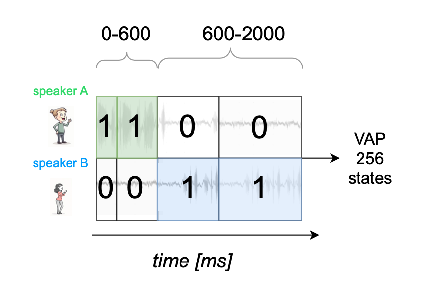

# Robust Multimodal Turn-taking in Noise

This repository contains the code for INTERSPEECH 2025 submission *Visual Cues Support Robust Turn-taking Prediction in Noise* Anonymous Authors. 

The following corpora are required for training and evaluation
- Candor corpus 
- MUSAN corpus
- LRS3 corpus

Permission has been sought to share a sample of the Candor corpus (`sample data`) for review (trimmed for filesize). 

A sample scipt can be run to generate predictions from trained models.


#### Multimodal turn-taking 

Model in: `turn_taking/model/multimodal_model.py`

<!-- ") -->


## Running the sample code

Create the conda environment and install the dependencies
```
conda create -n py312 python=3.12 pytorch torchvision torchaudio pytorch-cuda=12.4 -c pytorch -c nvidia -y
conda activate py312
conda env update --file environment.yml --prune
```

We have included sample models in `sample_trained_models`. 

There models are 
- `clean_audio_clean_alignment/audio_only`
- `clean_audio_clean_alignment/audio_and_video`
- `clean_audio_augmented_alignment/audio_only`
- `clean_audio_augmented_alignment/audio_and_video`
- `augmented_audio_augmented_alignment/audio_only`
- `augmented_audio_augmented_alignment/audio_and_video`


Additionally we have included the video-only model 
- `video_only`

The sample code opens these models and loads in the pre-trained weights. It is straightward to use a 16k stereo wav file of your choice, but the multimodal model requires OpenFace feature extraction. 

Our sample code can run the above models on clean speech or 0dB speech, babble and music noise provided in sample data. 

```
python sample.py --model MODEL --audio AUDIO --start_time XXX --end_time YYY
```

Where audio is `clean`, `babble`, `speech` or `music`

The sample code obtains predictions for the Candor scenario in `sample_data` (unused during training) and produces traces of the model predictions in the range `start_time`, `end_time`, as shown below. 

E.g. 

```
python sample.py --model clean_audio_clean_alignment/audio_only --audio clean --start_time 959 --end_time 968 
```

note the session was not seen by any model during training.

## Sample outputs 

Overcoming babble noise with visual cues


Audio-only model failing in babble noise


Audio-only model on clean speech


## Requirements 

We trained on an Nvidia RTX 6000 GPUs with Pytorch 2.5.0. Memory requirements vary per model. Model configurations are in the .yml files in `sample_trained_models`. 

GPU memory requirements:
- For training 33 GB GPU memory is required but can be reduced by lowering the batch size

Hard-drive requirements:
- The Candor corpus 887GB 


## Models

Sample results on the Candor corpus: multimodal left (ours), audio-only right (VAP) on clean speech
<!-- ") -->


`turn_taking/results` contain F1 and balanced accuracy for each fold of Candor

#### Training objective 

<!-- ") -->



## Data preparation and Training 

Code for adding the noise is available in `noise_generation`. The code requires LRS3 and MUSAN corpora. 

due to licencing restrictions, we cannot share the corpora (`turn-taking-projects` directory). If you have access to these corpora, training and validation sessions splits in `data_management/data_manager/assets/folds` and training can be run in `turn_taking/training/training_scripts_multimodal.py`. Full instructions will be provided at a later stage. 

We have made all training and data preparation code available for use if you have independent licences to Candor corpora follow the following steps: 

coming soon...

<!-- 1. Convert all files to wav and resample to 16 kHz
2. Unzip all Candor 


Feature extraction 
Openface docker image -- we have packaged code to make this easy to run 

If you have access to the corpora, proceed as follows...  -->

## References

### Our submission 
Please cite the following publication:

```
@inproceedings{anon_authors_2025,
    title = "Visual Cues Support Robust Turn-taking Predictions in Noise",
    author = "Anoymous",
    booktitle = "Anonymous INTERSPEECH 2025 submission"
}
```

### VAP Model

Stereo VAP Model (reimplementation of same used here)
```
@inproceedings{inoue-etal-2024-multilingual,
    title = "Multilingual Turn-taking Prediction Using Voice Activity Projection",
    author = "Inoue, Koji  and
      Jiang, Bing{'}er  and
      Ekstedt, Erik  and
      Kawahara, Tatsuya  and
      Skantze, Gabriel",
    editor = "Calzolari, Nicoletta  and
      Kan, Min-Yen  and
      Hoste, Veronique  and
      Lenci, Alessandro  and
      Sakti, Sakriani  and
      Xue, Nianwen",
    booktitle = "Proceedings of the 2024 Joint International Conference on Computational Linguistics, Language Resources and Evaluation (LREC-COLING 2024)",
    month = may,
    year = "2024",
    address = "Torino, Italia",
    publisher = "ELRA and ICCL",
    url = "https://aclanthology.org/2024.lrec-main.1036",
    pages = "11873--11883",
}
```

Original Mono VAP Model, for reference
```
@inproceedings{ekstedt23_interspeech,
  title     = {Automatic Evaluation of Turn-taking Cues in Conversational Speech Synthesis},
  author    = {Erik Ekstedt and Siyang Wang and Éva Székely and Joakim Gustafson and Gabriel Skantze},
  year      = {2023},
  booktitle = {INTERSPEECH 2023},
  pages     = {5481--5485},
  doi       = {10.21437/Interspeech.2023-2064},
  issn      = {2958-1796},
}
```

Elements of this repository are reproduced from the codebase (MIT Licence) 
```https://github.com/ErikEkstedt/VoiceActivityProjection```


### Candor

```
@article{reece2023candor,
  title={The CANDOR corpus: Insights from a large multimodal dataset of naturalistic conversation},
  author={Reece, Andrew and Cooney, Gus and Bull, Peter and Chung, Christine and Dawson, Bryn and Fitzpatrick, Casey and Glazer, Tamara and Knox, Dean and Liebscher, Alex and Marin, Sebastian},
  journal={Science Advances},
  volume={9},
  number={13},
  pages={eadf3197},
  year={2023},
  publisher={American Association for the Advancement of Science}
}

```

### MUSAN Corpus
```
https://www.openslr.org/17/ 

@article{snyder2015musan,
  title={Musan: A music, speech, and noise corpus},
  author={Snyder, David and Chen, Guoguo and Povey, Daniel},
  journal={arXiv preprint arXiv:1510.08484},
  year={2015}
}
```


### LRS3 corpus
```
@article{afouras2018lrs3,
  title={LRS3-TED: a large-scale dataset for visual speech recognition},
  author={Afouras, Triantafyllos and Chung, Joon Son and Zisserman, Andrew},
  journal={arXiv preprint arXiv:1809.00496},
  year={2018}
}
```
